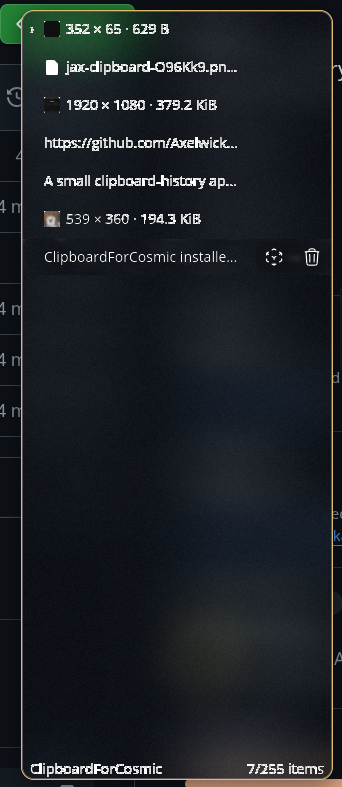

# ClipboardForCosmic

A small clipboard-history application for the COSMIC desktop, built with
libcosmic.



## Commands

```sh
# Run the background process manually (the tray icon opens the window)
cargo run

# Install or update, enable autostart, and start the user service
cargo run -- install

# Stop the service and remove all user-local files
cargo run -- uninstall

# Ask the running background service to show its window
cargo run -- show
```

To add a global shortcut, bind this command in COSMIC Settings → Keyboard →
Custom Shortcuts:

```sh
~/.local/bin/clipboard-for-cosmic show
```

On Debian/Ubuntu-based systems, libcosmic's usual build dependencies are:

```sh
sudo apt install cargo cmake libexpat1-dev libfontconfig-dev libfreetype-dev \
  libxkbcommon-dev pkgconf
```

## Supported clipboard types

ClipboardForCosmic supports:

- Plain text
- Colors
- Images: PNG, JPEG, WebP, GIF, BMP, TIFF, and SVG
- Files and folders copied through Wayland's URI-list formats

Clipboard entries are limited to 50 MiB.

## Features

- Clipboard history with configurable size
- Search through saved clipboard entries
- Image previews and file ↔ data conversion
- Re-copy and delete entries
- System-tray integration with optional global shortcut
